# 💊 Sistema de Cotação Inteligente - Drogaria Torres Farma

Um sistema completo (Web App) desenvolvido para automatizar, organizar e otimizar o processo de cotação de medicamentos e produtos de farmácia com múltiplos fornecedores. Este projeto visa reduzir o tempo operacional, evitar rupturas de estoque e garantir a escolha sempre da melhor oferta disponível no mercado.

---

## 🚀 Funcionalidades Principais

* 📊 **Dashboard Estratégico:** Visão geral do funil de cotações (Total, Em Aberto, Pendentes e Finalizadas).
* 🔗 **Integração com WhatsApp:** Envio de links de cotação diretamente para os fornecedores, com suporte a envios individuais ou em massa via Lista de Transmissão.
* 🔒 **Portal do Fornecedor:** Ambiente seguro onde o fornecedor faz login, visualiza os itens solicitados, preenche os preços unitários, informa a quantidade disponível e sinaliza itens em falta.
* 🏆 **Comparativo Automático:** O sistema analisa todas as respostas, ignora envios duplicados, trata itens em falta e destaca matematicamente a melhor oferta (menor preço válido) para cada produto.
* 📈 **Relatórios Analíticos:**
    * Histórico de Última Compra.
    * Relatório de Ruptura (produtos frequentemente em falta).
    * Ranking de Competitividade de Fornecedores.
* 📄 **Geração de Pedidos:** Exportação automática dos pedidos de compra divididos por fornecedor em formato PDF.
* 👥 **Gestão de Fornecedores:** Cadastro e gerenciamento de contatos e credenciais de acesso.

---

## 💻 Tecnologias Utilizadas

### Frontend
* **[React.js](https://reactjs.org/)** com **[Vite](https://vitejs.dev/)** para alta performance.
* **[React Router Dom](https://reactrouter.com/)** para roteamento de páginas protegidas e públicas.
* **[Axios](https://axios-http.com/)** para consumo da API RESTful.
* **[Lucide React](https://lucide.dev/)** para iconografia moderna.
* **[jsPDF](https://parall.ax/products/jspdf)** & **[jsPDF-AutoTable](https://github.com/simonbengtsson/jsPDF-AutoTable)** para geração de relatórios e faturas.

### Backend
* **[Java 17+](https://adoptium.net/)**
* **[Spring Boot 3](https://spring.io/projects/spring-boot)** (Web, Data JPA, Security).
* **[Hibernate](https://hibernate.org/)** para mapeamento objeto-relacional (ORM).
* **[PostgreSQL](https://www.postgresql.org/)** hospedado no **[Supabase](https://supabase.com/)**.

---

## 📸 Demonstração do Sistema

### Visão do Comprador (Administrador)
| Login | Dashboard |
| :---: | :---: |
| 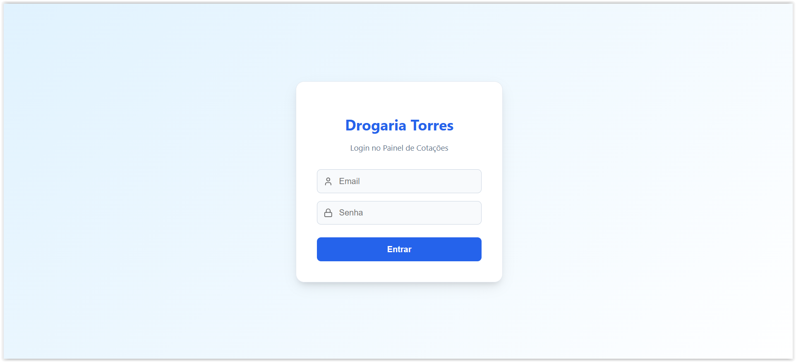 | 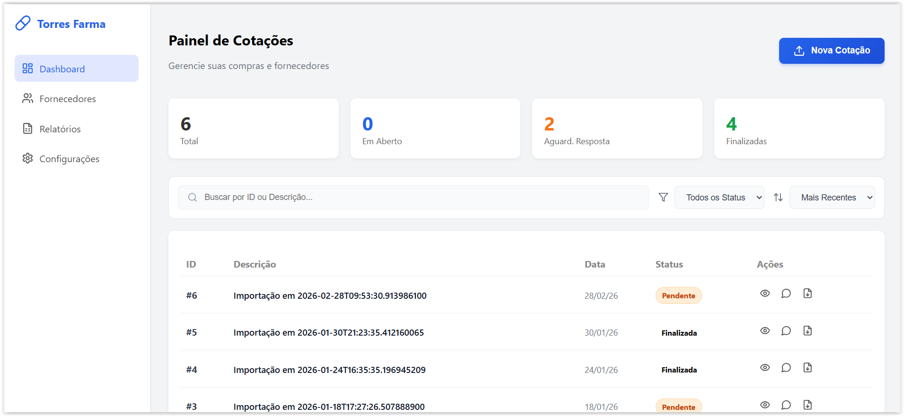 |
| *Tela de login principal do Dashbord* | *Painel de informações e análises das cotações* |

| Comparativo de Preços | Gerador de Pedido |
| :---: | :---: |
| 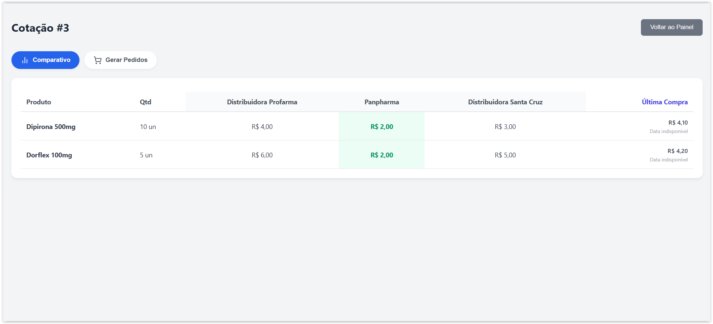 | 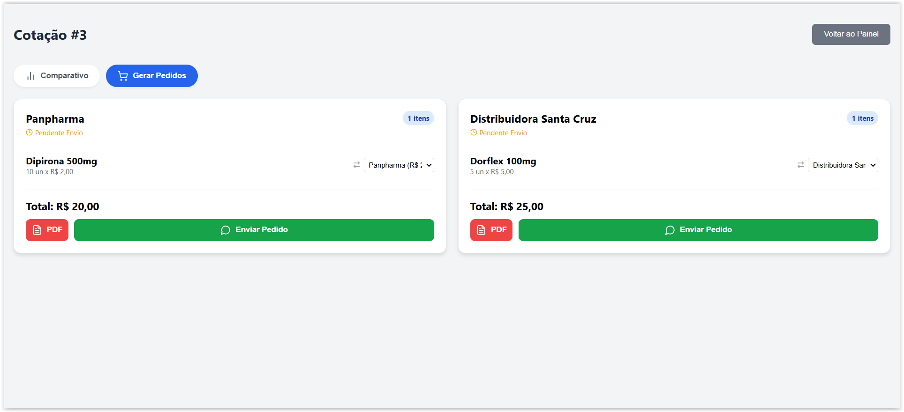 |
| *Análise inteligente das melhores ofertas* | *Gerador de pedidos dos produtos com os melhores preços* |

| Relatório Ranking | Relatório de Ruptura | Histórico de Preços
| :---: | :---: | :---: |
| 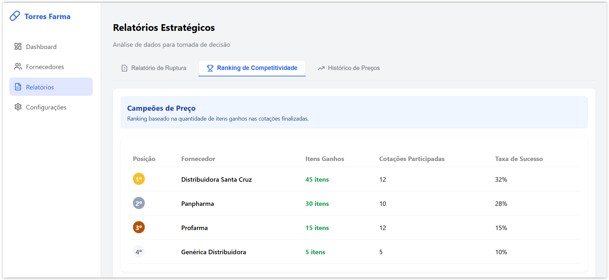 | 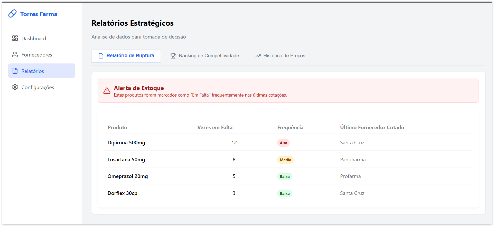 | 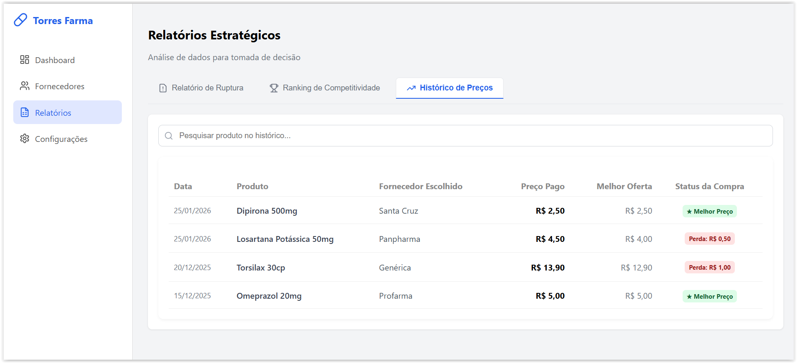 |
| *Ranking de melhores fornecedores* | *Relatório de alerta dos produtos com mais registros de falta* | *Histórico de preços dos produtos e comparação com a compra atual* |

| Envio do Link do Whatsapp | 
| :---: | 
| 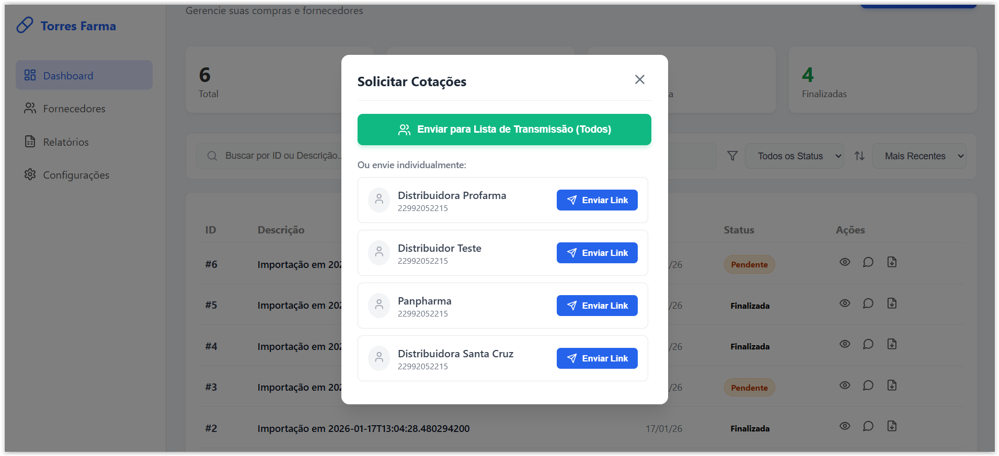 |
| | *Geração de link para Lista de Transmissão* |

| Cadastro Fornecedor | Painel Fornecedores |
| :---: | :---: |
| 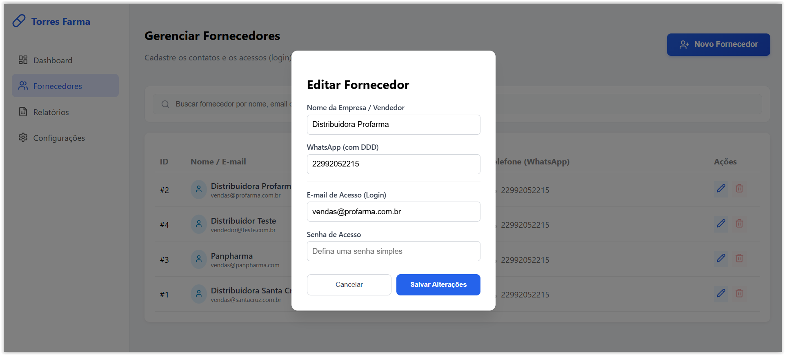 | 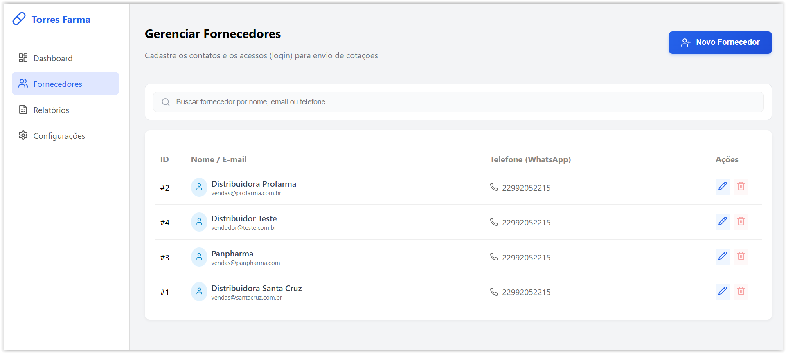 |
| | *Cadastro dos fornecedores* | *Painel dos fornecedores cadastrados e contatos* |

### Visão do Fornecedor
| Tela de Login Segura | Preenchimento da Cotação |
| :---: | :---: |
| 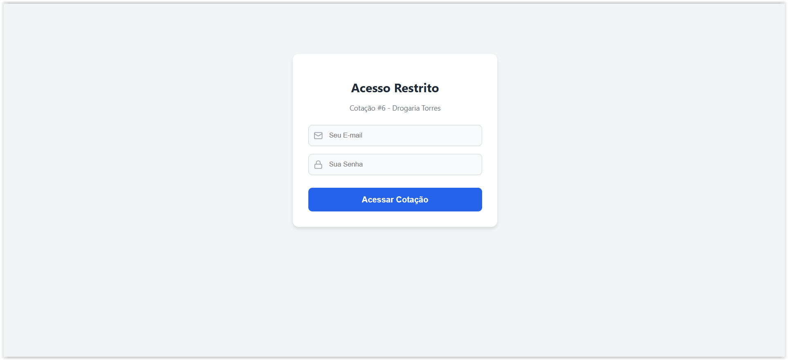 | 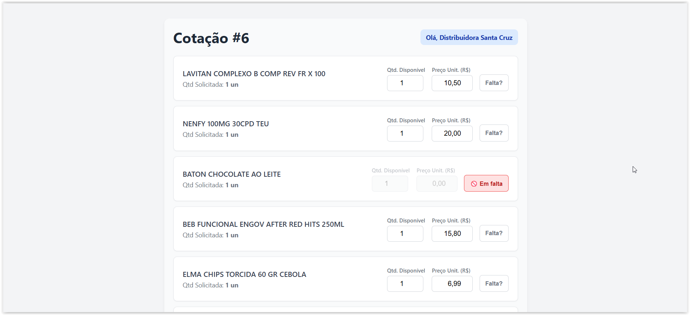 |
| *Acesso restrito por fornecedor* | *Campos para preço, quantidade e alerta de falta* |

---

Autor: [Gabriel-Torres](https://github.com/gabTorres2003)